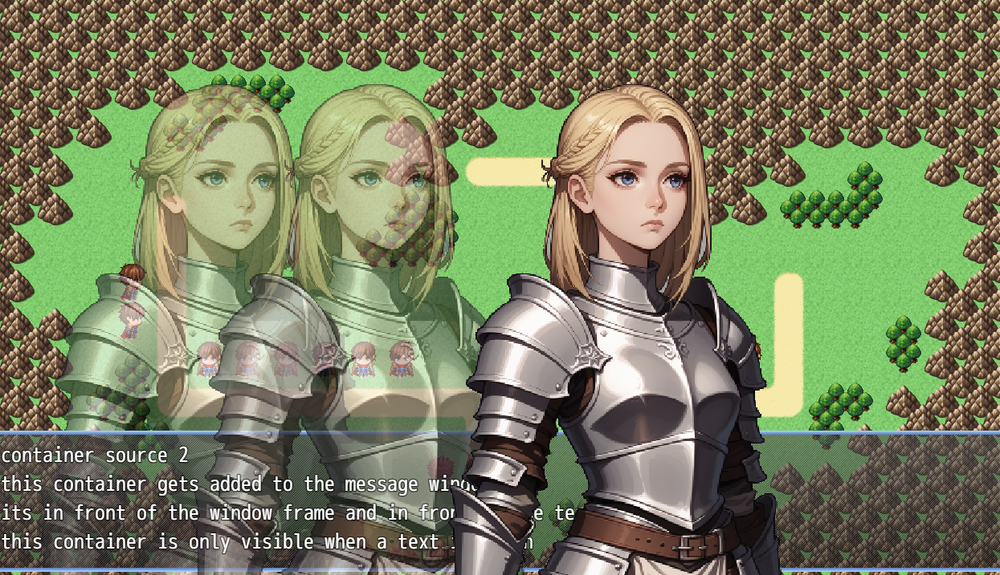

# RPG Maker MZ - VsLayeredDisplay Plugin
Version: 1.0.0

1. [Dependencies](#1-dependencies)
1. [Installation](#2-installation)
    1. [Fast](#21-fast)
    1. [Manual](#22-manual)
1. [Configuration](#3-configuration)
    1. [Plugin Configuration](#31-plugin-configuration)
1. [Usage](#4-usage)
    1. [RPG Maker Usage](#41-rpg-maker-usage)
        1. [Plugin Commands](#411-plugin-commands)
        1. [Show Text Commands](#412-show-text-commands)
    1. [Plugin Development & Scripting](#42-plugin-development--scripting)
1. [References](#5-references)
1. [How does the plugin work](#6-how-does-the-plugin-work)
1. [Changes to the core script](#7-changes-to-the-core-script)
1. [Troubleshooting](#8-troubleshooting)
1. [License](#9-license)

This plugin allows you to display and manage multi-layered graphics, such as character displays, scenes, animations etc. 
It supports plugin commands, scripting, and escape character commands in "Show Text" messages.


[  \
https://cloudd.zapto.org/examples/VsLayeredDisplay/](https://cloudd.zapto.org/examples/VsLayeredDisplay/)\


# 1. Dependencies
- Plugin [vsrpgdev/VsConvertEscapeCharacters v1.2+](https://github.com/vsrpgdev/VsConvertEscapeCharacters)
- Plugin [vsrpgdev/VsUtils v1.2+](https://github.com/vsrpgdev/VsUtils)
- Plugin [vsrpgdev/VsContainer v1.0+](https://github.com/vsrpgdev/VsContainer)
## 2. Installation 

## 2.1. fast

1. create a new rpg maker project or choose an existing one.
2. copy everything from the [demo](./demo/) directory into your rpg maker project directory\
**be mindfull of what you overwrite if you copy into an existing project**\
**make sure you dont already have an jsonconfig.json in your project**

## 2.2. manual

1. install and activate [VsConvertEscapeCharacters](https://github.com/vsrpgdev/VsConvertEscapeCharacters) from github
1. install and activate [VsUtils](https://github.com/vsrpgdev/VsUtils) from github
1. install and activate [VsContainer](https://github.com/vsrpgdev/VsContainer) from github
1. Copy [VsLayeredDisplay.js](./js/plugins/VsLayeredDisplay.js) into your plugin directory
2. Activate the Plugin in **RPG Maker**
3. make your configuration for the plugin
3. *[Optional]* if you want to use vscode IntelliSense also copy [VsLayeredDisplay.d.ts](./js/plugins/VsLayeredDisplay.d.ts) and [Vs.d.ts](./js/plugins/Vs.d.ts) into your plugins directory\
  Additionally, if you don’t already have one, copy  [jsconfig.json](./js/jsconfig.json) into you **js** directory (**not the plugin directory**).\
  to fully use IntelliSense you also ned type files for the rpg maker core files. you can use your own or copy the [types](./js/types/) folder into your js directory.
4. *[Optional]*  to get IntelliSense/Autocompletion for [VsLayeredDisplayJson.json](./data/VsLayeredDisplayJson.json) copy [VsLayeredDisplayConfig.schema.json](./data/VsLayeredDisplayConfig.schema.json) into your data directory
and [.vscode/settings.json](.vscode/settings.json) int your root/.vscode/settings.json if you already have a settings.json add these lines\ 
    ```javascript
    {
        "fileMatch": ["VsLayeredDisplayJson.json"],
        "url": "./data/vsLayeredDisplayConfig.schema.json" 
    } 
    ```

## 3. Configuration
### 3.1. Plugin Configuration
- ### Smooth scaling
  > ### **boolean**
  > | Value | Description |
  > | -- | -- |
  > | false | nearest neighbor (pixelated look) |
  > | true | linear (smooth but blurry look) |
  > default: **false**

  this sets the default scaling beheaviour for your displays (this value can be overwritten in a per display basis). 
---

- ### Enable usage in Messages
  > ### **boolean**
  > | Value | Description |
  > | -- | -- |
  > | false | escape characters cant be used to call plugin commands |
  > | true | its possible to call plugin commands in show text |
  > default: **true**

  enables the usage of show test escape commands
---
- ### Escape character
  > ### **string**
  > default: **B**

  specifies the escape character used in show text

---
- ### Autocreate in scene
  > ### **boolean**
  > | Value | Description |
  > | -- | -- |
  > | false | no autocreation |
  > | true | container gets created in every scene|
  > default: **true**
  should a container automatically be created in every scene (in Scene_Base)\
  **if set to false, no plugin commands can be used**
---
- ### Autocreate in window
  > ### **boolean**
  > | Value | Description |
  > | -- | -- |
  > | false | no autocreation |
  > | true | container gets in Window_Message
  > default: **true**
  should a container automatically be created Window_Message\
  **if set to false, no plugin commands can be used**
---


- ### message placement
  > ### **[Rect](#class-rect)**
  you can change your default message placement with this paramter.
  0 means 0% and 1 100% of your game window size
---
- ### display configuration
  > ### **[VsLayeredDisplayConfig](#class-vslayereddisplayconfig)**[]
  here you can specifiy your display configurations (different characters, scene, etc).\
  you can also define them in an additional optional json file see [Json Configuration](#32-json-configuration)
---

### 3.2. Json Configuration

- ### [data/VsLayeredDisplayJson.json](./data/VsLayeredDisplayJson.json)
  > ### **[Json Schema (VsLayeredDisplayConfig.schema.json)](./data/VsLayeredDisplayConfig.schema.json)**
  json file containing a list of **[VsLayeredDisplayConfig](#class-vslayereddisplayconfig)** configurations
## 4. Usage

to use LayeredDisplays you ned have
1. a VsMultiImageContainer from one or more of theses sources
    - Plugin Configuration [Autocreate in scene](#autocreate-in-scene)
    - Plugin Configuration [Autocreate in window](#autocreate-in-window)
    - (plugin developers) create your own container where you want it to be
1. create a new display with an existing or new configuration
    - load configuration from [data/VsLayeredDisplayJson.json](./data/VsLayeredDisplayJson.json)
    - load configuration from Plugin Paramter [display configuration](#display-configuration)
    - create a new configuration from one of the plugin or script commands
1. move the display to where you want it
1. set images of the display

### 4.1. RPG Maker Usage
you can use the plugin via plugin commands, show text commands or via the script command
### 4.1.1. Plugin Commands

### `SelectContainerSource`
**Description:** Selects which container should be used for drawing.
- **Arguments:**
  - `containerSource` (number, default: 0, min: 0, max: 2) - Defines the container source (0: scene, 1: message background, 2: message foreground).

---

### `ClearDisplays`
**Description:** Removes all displays.

---

### `AddDisplay`
**Description:** Creates a new display (overwrites existing one).
- **Arguments:**
  - `displayId` (number, default: 0) - Sprite ID (0 - infinity).
  - `config` (struct<[VsLayeredDisplayConfig](#class-vslayereddisplayconfig)>) - Display configuration.

---

### `AddDisplayByName`
**Description:** Creates a new display with a named config (overwrites existing one).
- **Arguments:**
  - `displayId` (number, default: 0) - Sprite ID (0 - infinity).
  - `configName` (string) - Display config name.

---

### `ChangeMessagePlacement`
**Description:** Changes the position and size of the message window.
- **Arguments:**
  - `messagePlacement` (struct<[Rect](#class-rect)>) - The new placement configuration.
- **Example:**
  ```
  ChangeMessagePlacement(0.2,-1,0,8,-1) 
  ```
  This changes only x and width.

---

### `RemoveDisplay`
**Description:** Removes a display.
- **Arguments:**
  - `displayId` (number, default: 0) - Sprite ID (0 - infinity).

---

### `EnsureDisplay`
**Description:** Ensures the display is created with a named config if it does not exist. already existing display remain unchanged
- **Arguments:**
  - `displayId` (number, default: 0) - Sprite ID (0 - infinity).
  - `configName` (string) - Config name.

---

### `SetImage`
**Description:** Sets an image for a display.
- **Arguments:**
  - `displayId` (number, default: 0) - Sprite ID (0 - infinity).
  - `imageId` (number, default: 0) - ID of the subimage (0 is the main image used for scaling).
  - `bitmap` (string) - Bitmap name.
  - `tileIndex` (number, default: 0) - Index from the grid. use 0 for files with no grid/tile

---

### `SetImages`
**Description:** Sets multiple images for a display.
- **Arguments:**
  - `displayId` (number, default: 0) - Sprite ID (0 - infinity).
  - `images` (struct<[ShowDisplay>](#class-showdisplay)[]) - List of images to set.

---

### `SetImagesEx`
**Description:** Sets multiple images with extended options.
- **Arguments:**
  - `displayId` (number, default: 0) - Sprite ID (0 - infinity).
  - `configName` (string) - Image config name.
  - `images` (struct<[ShowDisplay>](#class-showdisplay)[], default: []) - List of images to set.
  - `flipped` (boolean, default: false) - Whether to flip the image.
  - `opacity` (number, default: 255, min: 0, max: 255) - Opacity level.
  - `colorTone` (struct<ColorTone>, default: {"r":0,"g":0,"b":0,"gray":0}) - Color tone configuration.

---

### `ShowDisplay`
**Description:** Shows a display.
- **Arguments:**
  - `displayId` (number, default: 0) - Sprite ID (0 - infinity).

---

### `HideDisplay`
**Description:** Hides a display.
- **Arguments:**
  - `displayId` (number, default: 0) - Sprite ID (0 - infinity).

---

### `FlipDisplay`
**Description:** Flips a display.
- **Arguments:**
  - `displayId` (number, default: 0) - Sprite ID (0 - infinity).
  - `flipped` (boolean, default: false) - Whether to flip the display.

---

### `SetSmoothScaling`
**Description:** Enables or disables smooth scaling for a display.
- **Arguments:**
  - `displayId` (number, default: 0) - Sprite ID (0 - infinity).
  - `SmoothScaling` (boolean, default: false) - Enable or disable smooth scaling.

---

### `SetDisplayOpacity`
**Description:** Sets the opacity of a display.
- **Arguments:**
  - `displayId` (number, default: 0) - Sprite ID (0 - infinity).
  - `opacity` (number, default: 255) - Opacity level.

---

### `SetDisplayColorTone`
**Description:** Sets the color tone for a display.
- **Arguments:**
  - `displayId` (number, default: 0) - Sprite ID (0 - infinity).
  - `colorTone` (struct<ColorTone>) - Color tone configuration.

---

### `MoveToDisplay`
**Description:** Moves an object to a display.
- **Arguments:**
  - `displayId` (number, default: 0) - Sprite ID.
  - `x` (number, default: 0, min: 0, decimals: 6) - X coordinate.
  - `y` (number, default: 0, min: 0, decimals: 6) - Y coordinate.

---

### `MoveDisplay`
**Description:** Moves a display.
- **Arguments:**
  - `displayId` (number, default: 0) - Sprite ID.
  - `x` (number, default: 0, min: 0, decimals: 6) - X coordinate.
  - `y` (number, default: 0, min: 0, decimals: 6) - Y coordinate.

---

### `RotateDisplay`
**Description:** Rotates a display.
- **Arguments:**
  - `displayId` (number, default: 0) - Sprite ID.
  - `degrees` (number) - Rotation angle in degrees.

---

### `ResizeDisplay`
**Description:** Resizes a display.
- **Arguments:**
  - `displayId` (number, default: 0) - Sprite ID.
  - `w` (number, default: 0, min: 0, decimals: 6) - Width.
  - `h` (number, default: 0, min: 0, decimals: 6) - Height.

---

### `SetPivot`
**Description:** Sets the pivot point of a display.
- **Arguments:**
  - `displayId` (number, default: 0) - Sprite ID.
  - `x` (number, default: 0, min: 0, max: 1, decimals: 6) - X pivot point.
  - `y` (number, default: 0, min: 0, max: 1, decimals: 6) - Y pivot point.

---

### 4.1.2. Show Text Commands
you can also use layere displays in show text commands through escape characters if [enabled](#enable-usage-in-messages)
the escaped character can be selection in the plugin [configuration](#escape-character), default is **B**
paramters ar marked with <>, [] arguments are optional

### `\B[<source-id>]` - [select container source](#selectcontainersource)
**Description:** selects which container is the target for your display commands.
- **Arguments:**
  - `<source-id>` (0: scene, 1: message background, 2: message foreground).
- **examples:**
  `\B[0]` `\B[1]` `\B[2]`

---

### `\B[!<display-id>]` - [remove display](#removedisplay)
**Description:** removes a display
- **Arguments:**
  - `<display-id>` id of the display
- **examples:**
  `\B[!0]` `\B[!1]` `\B[!2]`

---

### `\B[.<display-id>]` - [hide display](#hidedisplay)
**Description:** hides a display
- **Arguments:**
  - `<display-id>` id of the display
- **examples:**
  `\B[.0]` `\B[.1]` `\B[.2]`

---

### `\B[+<display-id>]` - [show display](#showdisplay)
**Description:** hides a display
- **Arguments:**
  - `<display-id>` id of the display
- **examples:**
  `\B[+0]` `\B[+1]` `\B[+2]`

---

### `\B[<display-id>,<display-visible>]` - [hide display](#hidedisplay) or [show display](#showdisplay)
**Description:** sets visibility of a display
- **Arguments:**
  - `<display-id>` id of the display
  - `<display-visible>` true/false (show/hide display)
- **examples:**
  `\B[0,true]` `\B[1,false]` `\B[2,true]`
---

### `\B[<display-id>,<images>]` - [sets images](#setimages)
**Description:** sets images
- **Arguments:**
  - `<display-id>` id of the display
  - `<images>` ':' sperated list of image id and bitmap pairs (0:image1:1:image2:3:image3)
    you can leave bitmap empty to clear an image
- **examples:**
  `\B[0,0:body:1:face]` `\B[1,1:face:3:beard]` `\B[2,0::1:face]` `\B[2,1::2::3:clothing]`
---

### `\B[M<display-id>,<x>,<y>]` - [move display ](#movedisplay)
**Description:** move display by
- **Arguments:**
  - `<display-id>` id of the display
  - `<x>` ':' x alter x coordinate by **x**
  - `<y>` ':' y alter y coordinate by **x**
- **examples:**
  `\B[M0,0.2,0]` `\B[M1,0.3,0.5]``\B[M1,0.0,0.25]`
---

### `\B[T<display-id>,<x>,<y>]` - [move to display](#movetodisplay)
**Description:** move display to
- **Arguments:**
  - `<display-id>` id of the display
  - `<x>` ':' new x coordinate by **x**
  - `<y>` ':' new y coordinate by **x**
- **examples:**
  `\B[T0,0.2,0]` `\B[T1,0.3,0.5]``\B[T1,0.0,0.25]`
---

### `\B[R<display-id>,<w>,<h>]` - [resize display](#resizedisplay)
**Description:** resize display
- **Arguments:**
  - `<display-id>` id of the display
  - `<w>` ':' new width
  - `<h>` ':' new height
- **examples:**
  `\B[R0,0.2,0]` `\B[R1,0.3,0.5]``\B[R1,0.0,0.25]`
---

### `\B[<display-id>,<display-config>,<images>,[flip],[opacity],[color-tone]]` - [set images ex](#setimagesex)
**Description:** [ensures the display is created with config](#ensuredisplay) sets iamages, flip,opacity and color tone 
- **Arguments:**
  - `<display-id>` id of the display
  - `<display-config>` configuration name
  - `<images>` see [`\B[R<display-id>,<w>,<h>]`](#bdisplay-idimages---sets-images)
  - `<flip>` true/false should display be flipped
  - `<opacity>` 0-255 opacity of the display
  - `<color-tone>` red:green:blue:grey color tone of the display
- **examples:**
  - `\B[0,my-config,0,0:body:1:face]` select display 0, ensure my-config, set image 0 to body and 1 to face
  - `\B[0,my-config,0,0:body:2:beard,true]` select display 0, ensure my-config, set image 0 to body and 2 to beard, set flip to true
  - `\B[1,my-config,0,2:beard,,120]` select display 1, ensure my-config, set image 2 to beard, set opacity to 120
  - `\B[1,my-config,0,2:beard,false,210,10:0:0:0]` select display 1, ensure my-config, set image 2 to beard,set flip to false set opacity to 210 , set color tone
  - `\B[0,,,,,10:0:0:0]` select display 0, set color tone
  - `\B[3,,,,155]` select display 3, set opacity to 155
---

### 4.2 Plugin Development & Scripting
  for developer infos look at the typescript files (.d.ts) or the included [custom-layered-display](./demo/js/plugins/custom-layered-display.js) plugin
## 5. References
- ## Class **Rect**
  ### Members:
  > ### x number

  x position of the rectangle
  > ### y number

  y position of the rectangle
  > ### width number

  width of the rectangle
  > ### height number

  height of the rectangle
---

- ## Class **VsLayeredDisplayConfig**
  ### Members:
  > ### name string

  Name of the configuration.

  > ### imageFrame [VsDisplayImageConfig](#class-vsdisplayimageconfig)

  Image position and size (0-1).

  > ### pivot Point

  Image pivot position (0-1).

  > ### subImageCoordinates [VsDisplayImageConfig](#class-vsdisplayimageconfig)[]

  Position and size of subimages (in pixels).

  > ### autoScale "fill" | "contain" | "cover" | "x" | "y" | "none"

  Defines how the image scales to fit the containing box:
  - **fill**: Stretches to fill the width and height of the box.
  - **contain**: Maintains aspect ratio, scales to the smaller dimension.
  - **cover**: Maintains aspect ratio, scales to the larger dimension.
  - **x**: Scales to 100% width of the box.
  - **y**: Scales to 100% height of the box.
  - **none**: No scaling applied.

  > ### verticalAlign "top" | "bottom" | "middle"

  Specifies vertical alignment of the image inside the box.

  > ### horizontalAlign "left" | "right" | "center"

  Specifies horizontal alignment of the image inside the box.

  > ### clippingEnabled boolean

  Determines whether the image is clipped when outside the box.
  ---

## Class **VsDisplayImageConfig**
  ### Members:
  > ### x number

  X position of the image (0-1 for main image, pixel coordinates for subimages).

  > ### y number

  Y position of the image (0-1 for main image, pixel coordinates for subimages).

  > ### width number

  Width of the image (0-1 for main image, pixel coordinates for subimages). If set to 0, bitmap width is used.

  > ### height number

  Height of the image (0-1 for main image, pixel coordinates for subimages). If set to 0, bitmap height is used.

  > ### columns number

  Number of subimage columns in the picture file.

  > ### rows number

  Number of subimage rows in the picture file.

---

## Class **ShowDisplay**
  ### Members:
  > ### image id number

  the id of the image (links to the display configuration). id 0 is the main images

  > ### tileIndex number

  Index from the grid. use 0 for files with no grid/tile

  > ### bitmap number

  Width of the image (0-1 for main image, pixel coordinates for subimages). If set to 0, bitmap width is used.
---

## 6. How does the plugin work

the plugin creates two new DisplayObject (VsMultiImageContainer and VsLayeredDisplayContainer) which handle all the image operations.
depending of your configuration these Objects gets inserted into every Scene or Message Window.
For every new Display a new bitmap gets created (the same size as the main image) on which the main image and all sub images gets drawn to.
These bitmap can now with the help of the plugin commands be changed, sized, moved etc on the scene.
## 7. Changes to the core script
here you can look for possible conflicts with other plugins which change the same files
  - ## rmmz_windows.js
    - ### Window_Message 
      - ### updatePlacement
        **method override, orignal gets called**\
        method gets overidden to update the VsMultiImageContainer position and size to fit the message window

      - ### _createAllParts
        **method override, orignal gets called**\
        add an instance of VsMultiImageContainer to the window
      - ### _createContainer
        **method override, orignal gets called**\
        add an instance of VsMultiImageContainer to the window
  - ### rmmz_managers.js
    - ### DataManager 
      - ### _databaseFiles
        **entry added to the list**\
        VsLayeredDisplayJson.json get added to the loading list of the DataManager
      - ### DataManager_onXhrError
        **method override, orignal gets called**
        VsLayeredDisplayJson.json missing file error gets ignored
      - ### DataManager_onXhrLoad
        **method override, orignal gets called**\
        update the VsLayeredDisplayConfig from the json file
  - ### rmmz_sprites.js
    - ### Spriteset_Base
      - createPictures
        **method override, orignal gets called**\
        add an instance of VsMultiImageContainer to the scene
## 8. Troubleshooting

## 9. License
VsConvertEscapeCharacters by rpgmakerwebthickness467 is marked with CC0 1.0 Universal. To view a copy of this license, visit https://creativecommons.org/publicdomain/zero/1.0/